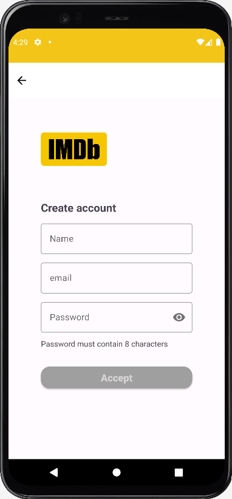
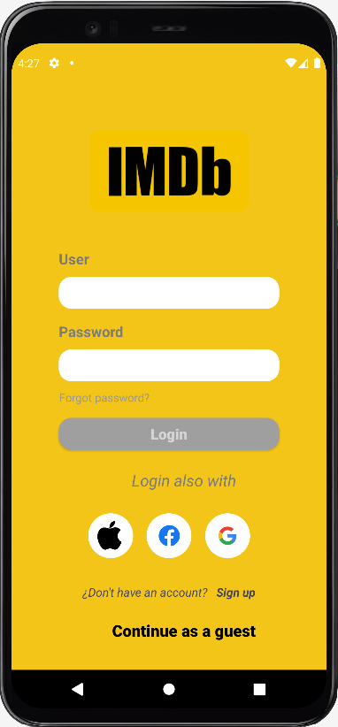
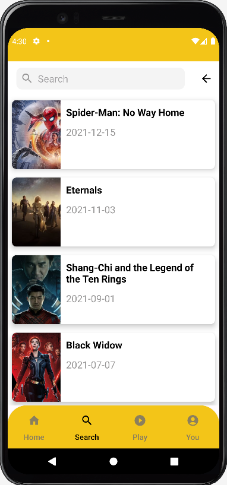

# Android Bootcamp Project (IMDb clon)

This is an academic project to make an Android app based in the movie database app IMDb, that includes good practices as Solid Principles and Clean Architecture and  implement api consumption with Retrofit and dependency injection with Dagger Hilt. 

## How does it work? 🚀

This app was build under clean architecture suggested by google and uses MVVM as arquitecteure pattern.  You can access the app either as logged user or as invited. If you are not registered, you can sign up in the sign up option from login screen. Once inside the app you can navigate between three options: home, search and user.

In home screen are shown the top rated movies in a horinzontal view. THe search screen you can search your favourite movie through the search bar, the movies are listed in a vertical recycler view according what you have written previously as input. Finally is the user screen where some user's details are shown (if you are logged).

The movie data is obtained from https://www.themoviedb.org/documentation/api using retrofit and the user data is stored and recovered from firebase.

There is an input box where you can filter your task. Each task (also called todo) has both a check  and a delete icon where you can mark a todo as completed or delete it respectively. Finally there is a button with the sign "+" where you'll be able to add more tasks.

## Built with 🛠️
 

## Preview
   

